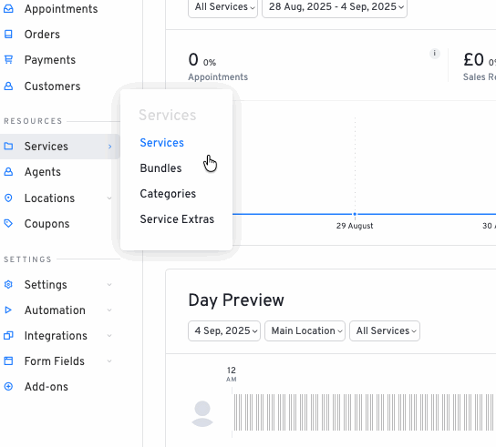

# LatePoint Quick Status

A WordPress plugin addon for LatePoint that adds a toggle button to enable/disable services directly from the services list.



## Features

- **Quick Toggle**: Enable/disable services with a single click
- **Real-time Updates**: AJAX-powered status changes without page reload
- **Visual Feedback**: Color-coded buttons showing current status
- **Security**: Proper nonce verification and capability checks
- **Seamless Integration**: Integrates perfectly with LatePoint's admin interface

## Installation

1. Upload the `latepoint-quick-status` folder to your `/wp-content/plugins/` directory
2. Activate the plugin through the 'Plugins' menu in WordPress
3. Ensure LatePoint is installed and activated

## Usage

1. Navigate to LatePoint → Services in your WordPress admin
2. Each service card will now have a status toggle button
3. Click the button to instantly enable/disable the service
4. The button will update in real-time with the new status

## Technical Details

### Integration Points

- **Registration**: Uses `latepoint_installed_addons` filter to register with LatePoint
- **UI Integration**: Uses `latepoint_service_tile_info_rows_after` hook to add toggle buttons
- **Asset Loading**: Uses `latepoint_admin_enqueue_scripts` to load JS/CSS
- **AJAX Handling**: Custom `wp_ajax_lp_toggle_service` endpoint for status toggling

### Security Features

- **Nonce Verification**: Prevents CSRF attacks
- **Capability Checking**: Only users with `manage_options` capability can toggle services
- **Input Sanitization**: All inputs are properly validated and sanitized
- **Error Handling**: Comprehensive error messages and proper HTTP status codes

### File Structure

```
latepoint-quick-status/
├── latepoint-quick-status.php         # Main plugin file
├── assets/
│   ├── js/
│   │   └── toggle.js                  # JavaScript functionality
│   └── css/
│       └── style.css                  # CSS styling
├── languages/                         # Translation files
├── lib/
│   ├── helpers/
│   │   └── quick_status_helper.php    # Helper functions
│   ├── controllers/                   # Controller classes
│   ├── models/                        # Model classes
│   └── views/                         # View templates
└── README.md                          # This file
```

## Development

### Testing

The plugin includes comprehensive test scripts:

1. **Integration Test**: `test-integration.php` - Tests LatePoint integration
2. **Security Test**: `security-test.php` - Tests security measures
3. **Functionality Test**: `functionality-test.php` - Tests core functionality

### Customization

#### CSS Styling

The toggle button styles can be customized by modifying `assets/css/style.css`. The button uses the following CSS classes:

- `.lp-toggle-service` - Base button style
- `[data-status="active"]` - Red button for active services (Disable button)
- `[data-status="disabled"]` - Green button for disabled services (Enable button)

#### JavaScript Behavior

The AJAX behavior can be customized in `assets/js/toggle.js`. Key features include:

- Loading state animation
- Success/error notifications
- Automatic page reload after successful toggle

## Requirements

- WordPress 5.0+
- LatePoint 5.0+
- PHP 7.4+

## Support

For support and bug reports, please contact the plugin author.

## License

This plugin is released under the GPL v2 or later license.

## Changelog

### 1.0.0
- Initial release
- Complete integration with LatePoint
- AJAX-powered service toggling
- Comprehensive security measures
- Professional UI styling with color-coded buttons (green for disabled, red for enabled)
